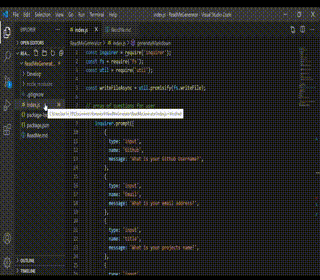

# My Project Name: ReaMe Generator
## License
  MIT

## Description 
  Answer a series of questions in the node.js terminal to generate a ReadMe file for your project.

## Table of Contents:
      
  * [Installation](#installation)
  * [Usage](#usage)
  * [License](#license)
  * [Contributing](#contributing)
  * [Test](#test)
    
## Installation
  npm i

## Usage 
  Will be adding more material to ReadMe soon.

## Contributing 
  Reach out via email with any suggesstions.

## Test 
The application will be evoked using the following command:

  npm test

    
## Questions
If you have any additional questions you can reach me on my Github:Kar3n33 or Email:kar3n.acosta@gmail.com

## Animated Application Walkthrough
      
      